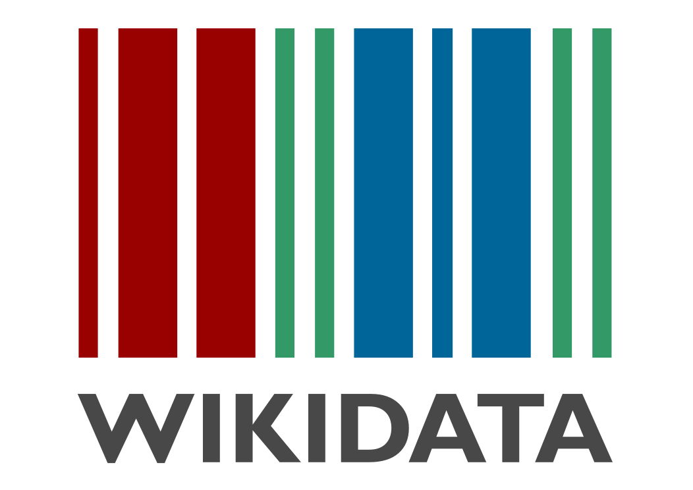
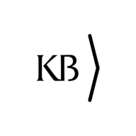

# OpenRefine-Wikidata Introduction Workshop

*A practical 90 minutes workshop (in Dutch) to learn how to work with OpenRefine and Wikidata at a basic level.*

## Learning objectives

[OpenRefine](https://openrefine.org/) is a well-known tool for editing, enriching and manipulating data. It is widely used within the Wikimedia community to add data to [Wikidata](https://www.wikidata.org/).

In this practial 90 minutes workshop you will learn the basics of working with OpenRefine to manipulate data and add it to Wikidata. You will learn 
* how to create an OpenRefine project,
* how to manipulate and enrich data, and
* how to connect this data to databases such as Wikidata, [NTA](http://data.bibliotheken.nl/doc/dataset/persons) or [VIAF](https://www.viaf.org/).

## Target audience
This workshop is suitable for people who
* have some experience in working with (cultural heritage) data, 
* have not used OpenRefine before, 
* want to learn the basics of manipulating, enriching and linking data with this tool, but  
* who do not necessarily know what "reconciling against Wikidata" means. 

## Workshop outline & resources
* [Full outline and notes](outline-and-notes.md) of the workshop. This is a detailed list of actions we will be performing during the workshop.
* Working materials (in Dutch): [Werkmaterialen introductieworkshop OpenRefine, KB, 4 juni 2023](https://raw.githubusercontent.com/KBNLwikimedia/OpenRefine-Introduction-Workshop/master/Werkmaterialen%20introductieworkshop%20OpenRefine%204%20juli%202023_OJ27062023.pdf). This document contains the working materials (links and data) that we will be using during the workshop.
* Recources: [Overzicht online les- en hulpmaterialen OpenRefine_OJ22062023.pdf](https://raw.githubusercontent.com/KBNLwikimedia/OpenRefine-Introduction-Workshop/master/Overzicht%20online%20les-%20en%20hulpmaterialen%20OpenRefine_OJ22062023.pdf). A selection of useful tutorials, courses, documentation, howtos, videos etc. about Openrefine. Mainly intended for providing references, further reading and more advanced materials for after the workshop.

## Required preparation
* Install a recent version of OpenRefine on your machine. It can be downloaded from https://github.com/OpenRefine/OpenRefine/releases. 
* Create an account on Wikidata - https://www.wikidata.org/w/index.php?title=Special:CreateAccount
* Please bring your own laptop to this workshop.
* It would be nice if you have Excel installed as well (but if you haven't, it is not a deal breaker)

## Workshop leader
This workshop is given by [Olaf Janssen](https://www.wikidata.org/wiki/User:OlafJanssen), the Wikimedia coordinator of the [Koninklijke Bibliotheek](https://www.kb.nl/over-ons/experts/olaf-janssen), the national library of the Netherlands. In this role he stimulates and facilitates collaboration between the collections, knowledge, open data and staff of the KB on the one hand, and the projects of the Wikimedia movement, such as Wikipedia, Wikimedia Commons, Wikidata and Wikibase, on the other. He is also active as a volunteer within the community.

If you are interested in this workshop, feel free to contact Olaf via olaf.janssen(at)kb.nl 

## Workshop instances
This workshop was given for 
* KB, national library of the Netherlands,  4 July 2023 
* ...
 
## Licensing
All workshop materials are released under the Creative Commons [Attribution-ShareAlike 4.0 International (CC BY-SA 4.0)](https://creativecommons.org/licenses/by-sa/4.0/deed.en) license. Attribution: Olaf Janssen/KB, national library of the Netherlands. 

## Other versions
The materials of this workshop are also published on Zenodo: https://zenodo.org/record/8207914 / https://doi.org/10.5281/zenodo.8207914  

## Latest updates
This page was last updated on 3 August 2023.
